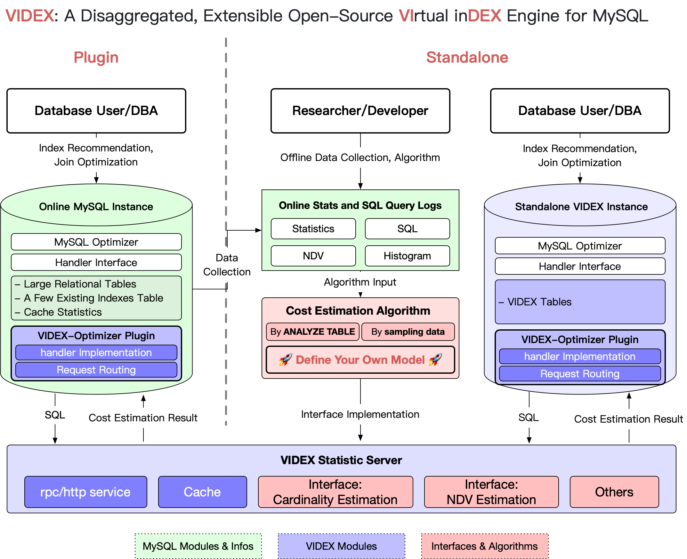
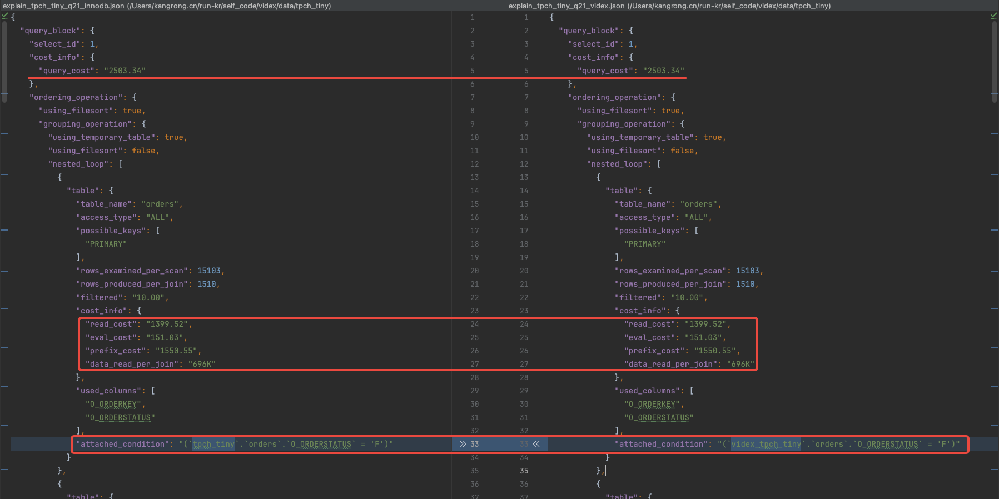
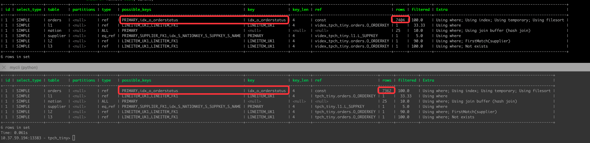
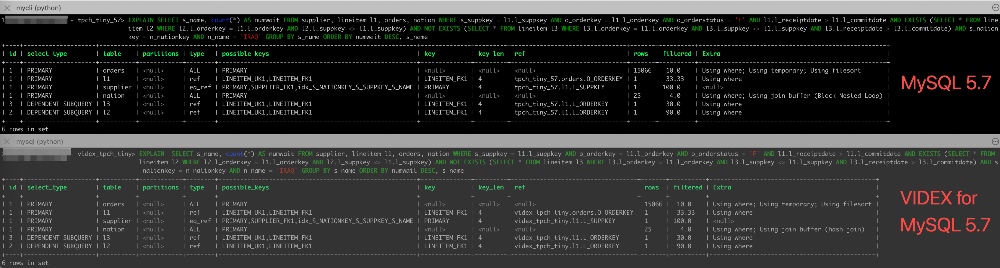
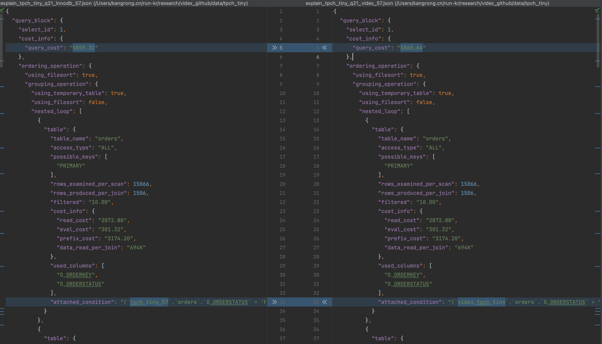
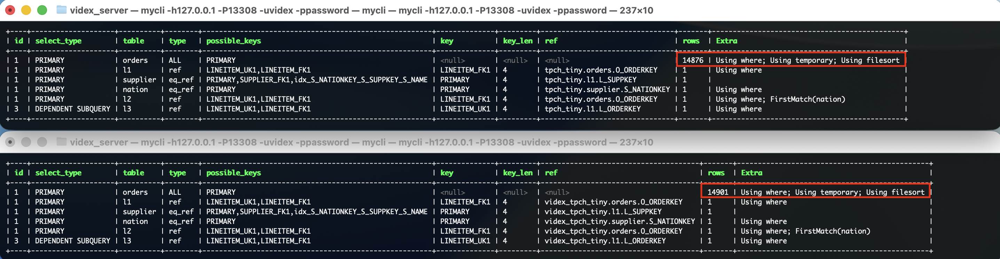
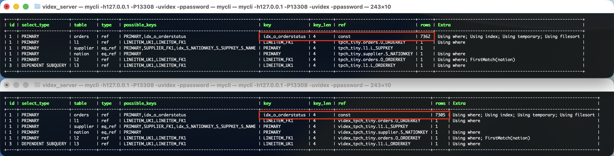
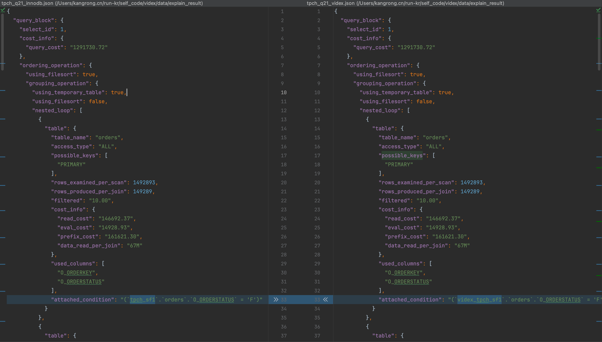

# VIDEX

<p align="center">
  <a href="./README.md">English</a> |
  <a href="./README_zh.md">简体中文</a>
</p>

<p align="center">
  <a href="https://www.youtube.com/watch?v=Cm5O61kXQ_c">
    
  </a>
  <a href="https://hub.docker.com/repository/docker/kangrongme/videx">
    
  </a>
  <a href="https://arxiv.org/abs/2503.23776">
    
  </a>
  
  
</p>

**VIDEX** 为 MySQL 提供了一个解耦的、可扩展的开源虚拟索引引擎 (**\[VI\]**rtual in**\[DEX\]**)。

- **虚拟索引**：不需要真实数据、仅基于统计信息和算法模型，即可高精度地模拟 MySQL 产生的查询计划、模拟表连接顺序、模拟索引选择；
- **分离式架构** (Disaggregated)：VIDEX 支持在单独的实例上部署，而不必须在原始库 MySQL 上安装；VIDEX 支持独立启动算法服务，而不必嵌入 MySQL 中；
- **可拓展** (Extensible)：VIDEX提供了便捷的接口，用户可以将 基数估计（Cardinality）、独立值估计（NDV） 等算法模型应用于 MySQL 的下游任务中（例如索引推荐）；


## Latest News

- **[2025-05-28]** 🥳🎉VIDEX demo 论文被 **VLDB 2025 Demo Track** 接收!🥳🎉 "VIDEX: A Disaggregated and Extensible Virtual Index for the Cloud and AI Era" ([arXiv Preprint](https://arxiv.org/abs/2503.23776) | [How to Cite](#paper-citation))
- **[2025-04-28]** VIDEX [v0.1.0](https://github.com/bytedance/videx/releases/tag/v0.1.0) 发布.

## What's VIDEX

“虚拟索引” 旨在模拟 SQL 查询计划中使用索引的代价（cost）， 从而向用户展示索引对 SQL 计划的影响，而无需在原始实例上创建实际索引。
这项技术广泛应用于各种 SQL 优化任务，包括索引推荐和表连接顺序优化。
业界许多数据库已经以官方或第三方的方式提供了虚拟索引功能，
例如 [Postgres](https://github.com/HypoPG/hypopg)、
[Oracle](https://oracle-base.com/articles/misc/virtual-indexes) 和
[IBM DB2](https://www.ibm.com/docs/en/db2-for-zos/12?topic=tables-dsn-virtual-indexes)。

> **注意**：此处使用的“虚拟索引”一词与
> [MySQL 官方文档](https://dev.mysql.com/doc/refman/8.4/en/create-table-secondary-indexes.html) 中提及的“虚拟索引”不同，
> 后者指的是在虚拟生成列上构建的索引。

此外，VIDEX 封装了一组用于成本估算的标准化接口，
解决了学术研究中的热门话题，如 **基数估计** 和 **不同值数量（NDV）估计**。
研究人员和数据库开发人员可以轻松地将自定义算法集成到 VIDEX 中以用于优化任务。
默认情况下，VIDEX 可以以 `ANALYZE TABLE` 的方式收集统计信息，或者基于少量采样数据构建统计信息。

VIDEX 提供两种启动模式：
1. **作为插件安装到生产数据库** (Plugin-Mode)：将 VIDEX 作为插件安装到生产数据库实例。
2. **独立实例** (Standalone-Mode)：此模式可以完全避免影响在线运行实例的稳定性，在工业环境中很实用。

在功能方面，VIDEX 支持创建和删除索引（单列索引、复合索引、EXTENDED_KEYS 索引、[倒序索引](https://dev.mysql.com/doc/en/descending-indexes.html)）。
目前暂不支持函数索引（`functional indexes`）、全文索引（`FULL-Text`）和空间索引（`Spatial Indexes`）。

在**拟合精度**方面，我们已经在 `TPC-H`、`TPC-H-Skew` 和 `JOB` 等复杂分析基准测试上对 VIDEX 进行了测试。
<font color="red">给定准确的 ndv 和 cardinality 信息，**VIDEX 可以 100% 模拟 MySQL InnoDB 的查询计划**。</font>
（更多详细信息请参考 [Example: TPC-H](#3-示例) 章节）。

我们期望 VIDEX 能为用户提供一个更好的平台，以便更轻松地测试基数和 NDV 算法的有效性，并将其应用于 SQL 优化任务。VIDEX已经部署在了字节跳动大规模生产系统中，为日常慢SQL优化提供服务。


---

## 1. 概览

<p align="center">
  
</p>

VIDEX 包含两部分：

- **VIDEX-Optimizer-Plugin** （简称为 **VIDEX-Optimizer**）：全面梳理了 MySQL handler 的超过90个接口函数，并实现与索引（Index）相关的部分。
- **VIDEX-Statistic-Server**（简称 **VIDEX-Server**）：根据收集的统计信息和估算算法计算独立值（NDV） 和基数（Cardinality），并将结果返回给 VIDEX-Optimizer 实例。

VIDEX 根据原始实例中指定的目标数据库（`target_db`）创建一个虚拟数据库，并创建相同结构的关系表（具有相同的 DDL，但将引擎从 `InnoDB` 更换为 `VIDEX`）。

## 2. Quick Start

### 2.1 安装 Python 环境

VIDEX 需要 Python 3.9 环境，执行元数据采集等任务。推荐使用 Anaconda/Miniconda 创建独立的 Python 环境：

**对于 Linux/macOS 用户：**
```bash
# 克隆代码
VIDEX_HOME=videx_server
git clone git@github.com:bytedance/videx.git $VIDEX_HOME
cd $VIDEX_HOME

# 创建并激活 Python 环境
conda create -n videx_py39 python=3.9
conda activate videx_py39

# 安装 VIDEX
python3.9 -m pip install -e . --use-pep517
```

**对于 Windows 用户：**
```cmd
# 克隆代码（需提前安装 Git）
set VIDEX_HOME=videx_server
git clone git@github.com:bytedance/videx.git %VIDEX_HOME%
cd %VIDEX_HOME%

# 创建并激活 Python 环境
conda create -n videx_py39 python=3.9
conda activate videx_py39

# 安装 VIDEX（根据实际 Python 路径调整）
python -m pip install -e . --use-pep517 
```
### 2.2 启动 VIDEX (Docker方式)

为简化部署，我们分别提供了MySQL和MariaDB预编译的 Docker 镜像，包含:

**MySQL 版本：**
- VIDEX-Optimizer: 基于 [Percona-MySQL 8.0.34-26](https://github.com/percona/percona-server/tree/release-8.0.34-26)，并集成 VIDEX 插件
- VIDEX-Server: 提供 ndv 和 cardinality 算法服务

**MariaDB 版本：**
- VIDEX-Optimizer: 基于 [MariaDB 11.8.2](https://github.com/MariaDB/server/tree/11.8)，并集成 VIDEX 插件  
- VIDEX-Server: 提供 ndv 和 cardinality 算法服务

#### 2.2.1 安装 Docker
如果您尚未安装 Docker:
- [Docker Desktop for Windows/Mac](https://www.docker.com/products/docker-desktop/)
- Linux: 参考[官方安装指南](https://docs.docker.com/engine/install/)

#### 2.2.2 启动 VIDEX 容器

##### MySQL 版本

```bash
docker run -d -p 13308:13308 -p 5001:5001 --name videx kangrongme/videx:latest
```

##### MariaDB 版本

```bash
docker run -d -p 13308:13308 -p 5001:5001 --name mariadb_videx kangrongme/mariadb_videx:0.0.1
```

> **端口说明**
> - `13308`: MySQL/MariaDB 服务端口
> - `5001`: VIDEX-Server 服务端口

> **其他部署方式**
>
> VIDEX 还支持以下部署方式，详见 [安装指南](doc/installation_zh.md):
> - 从源码编译完整的 MySQL Server
> - 仅编译 VIDEX 插件并安装到现有 MySQL
> - 独立部署 VIDEX-Server (支持自定义优化算法)

## 3. 示例

### 3.1 TPCH-Tiny 示例 (MySQL 8.0)

本示例使用 `TPC-H Tiny` 数据集(从 TPC-H sf1 随机采样 1% 数据)演示 VIDEX 的完整使用流程。

#### 环境说明

示例假设所有组件都通过 Docker 部署在本地:

组件 | 连接信息
---|---
Target-MySQL (生产库) | 127.0.0.1:13308, 用户名:videx, 密码:password
VIDEX-Optimizer-Plugin (插件) | 同 Target-MySQL
VIDEX-Server | 127.0.0.1:5001

#### Step 1: 导入测试数据

**对于 Linux/macOS 用户：**
```bash
# 切换到项目目录（假设已设置 VIDEX_HOME 环境变量）
cd %VIDEX_HOME%
# 下载测试数据

# 创建数据库
mysql -h127.0.0.1 -P13308 -uvidex -ppassword -e "create database tpch_tiny;"

# 导入数据
gunzip  data/tpch_tiny/tpch_tiny.sql.gz
mysql -h127.0.0.1 -P13308 -uvidex -ppassword -Dtpch_tiny < tpch_tiny.sql
```

**对于 Windows 用户：**
```cmd
# 切换到项目目录（假设已设置 VIDEX_HOME 环境变量）
cd %VIDEX_HOME%
# 下载测试数据

# 创建数据库
mysql -h127.0.0.1 -P13308 -uvidex -ppassword -e "create database tpch_tiny;"

# 导入数据
gunzip  data/tpch_tiny/tpch_tiny.sql.gz
mysql -h127.0.0.1 -P13308 -uvidex -ppassword -Dtpch_tiny < tpch_tiny.sql
```

#### Step 2: VIDEX 采集并导入 VIDEX 元数据

请确保 VIDEX 环境已经安装好。若尚未安装，请参考 [2.1 安装 Python 环境](#21-安装-python-环境)。

**对于 Linux/macOS 用户：**
```shell
cd $VIDEX_HOME
python src/sub_platforms/sql_opt/videx/scripts/videx_build_env.py \
 --target 127.0.0.1:13308:tpch_tiny:videx:password \
 --videx 127.0.0.1:13308:videx_tpch_tiny:videx:password
```

**对于 Windows 用户：**
```cmd
cd %VIDEX_HOME%
# Windows CMD 不支持 \ 作为续行符，需在同一行内输入所有参数
python src/sub_platforms/sql_opt/videx/scripts/videx_build_env.py --target "127.0.0.1:13308:tpch_tiny:videx:password" --videx "127.0.0.1:13308:videx_tpch_tiny:videx:password"
```

输出如下：
```log
2025-02-17 13:46:48 [2855595:140670043553408] INFO     root            [videx_build_env.py:178] - Build env finished. Your VIDEX server is 127.0.0.1:5001.
You are running in non-task mode.
To use VIDEX, please set the following variable before explaining your SQL:
--------------------
-- Connect VIDEX-Optimizer-Plugin: mysql -h127.0.0.1 -P13308 -uvidex -ppassowrd -Dvidex_tpch_tiny
USE videx_tpch_tiny;
SET @VIDEX_SERVER='127.0.0.1:5001';
-- EXPLAIN YOUR_SQL;
```

现在元数据已经收集完毕、并导入 VIDEX-Server。json 文件已经写入 `videx_metadata_tpch_tiny.json`。

如果用户预先准备了元数据文件，则可以指定 `--meta_path` ，跳过采集阶段，直接导入。

#### Step 3: EXPLAIN SQL

连接到 VIDEX 实例，或者 VIDEX-Optimizer-Plugin 所在的实例上，执行 EXPLAIN。

为了展示 VIDEX 的有效性，我们对比了 TPC-H Q21 的 EXPLAIN 细节，这是一个包含四表连接的复杂查询，涉及 `WHERE`、`聚合`、`ORDER BY`、
`GROUP BY`、`EXISTS` 和 `自连接` 等多种部分。MySQL 可以选择的索引有 11 个，分布在 4 个表上。

由于 VIDEX-Server 部署在 VIDEX-Optimizer-Plugin 所在节点、并且开启了默认端口（5001），因此我们不需要额外设置 `VIDEX_SERVER`。
如果 VIDEX-Server 部署在其他节点，则需要先执行 `SET @VIDEX_SERVER`。

```sql
-- SET @VIDEX_SERVER='127.0.0.1:5001'; -- 以 Docker 启动，则不需要额外设置 
-- Connect VIDEX-Optimizer: mysql -h127.0.0.1 -P13308 -uvidex -ppassword -Dvidex_tpch_tiny
-- USE videx_tpch_tiny;
EXPLAIN
FORMAT = JSON
SELECT s_name, count(*) AS numwait
FROM supplier,
     lineitem l1,
     orders,
     nation
WHERE s_suppkey = l1.l_suppkey
  AND o_orderkey = l1.l_orderkey
  AND o_orderstatus = 'F'
  AND l1.l_receiptdate > l1.l_commitdate
  AND EXISTS (SELECT *
              FROM lineitem l2
              WHERE l2.l_orderkey = l1.l_orderkey
                AND l2.l_suppkey <> l1.l_suppkey)
  AND NOT EXISTS (SELECT *
                  FROM lineitem l3
                  WHERE l3.l_orderkey = l1.l_orderkey
                    AND l3.l_suppkey <> l1.l_suppkey
                    AND l3.l_receiptdate > l3.l_commitdate)
  AND s_nationkey = n_nationkey
  AND n_name = 'IRAQ'
GROUP BY s_name
ORDER BY numwait DESC, s_name;
```

我们对比了 VIDEX 和 InnoDB。我们使用 `EXPLAIN FORMAT=JSON`，这是一种更加严格的格式。
我们不仅比较表连接顺序和索引选择，还包括查询计划的每一个细节（例如每一步的行数和代价）。

如下图所示，VIDEX（左图）能生成一个与 InnoDB（右图）几乎 100% 相同的查询计划。
完整的 EXPLAIN 结果文件位于 `data/tpch_tiny`。



请注意，VIDEX 的准确性依赖于如下三个关键的算法接口：
- `ndv`
- `cardinality`
- `pct_cached`（索引数据加载到内存中的百分比）。未知的情况下可以设为 0（冷启动）或 1（热数据），但生产实例的 `pct_cached` 可能会不断变化。

VIDEX 的一个重要作用是模拟索引代价。我们额外新增一个索引。VIDEX 增加索引的代价是 `O(1)` ：

```sql
ALTER TABLE tpch_tiny.orders ADD INDEX idx_o_orderstatus (o_orderstatus);
ALTER TABLE videx_tpch_tiny.orders ADD INDEX idx_o_orderstatus (o_orderstatus);
```

再次执行 EXPLAIN，我们看到 MySQL-InnoDB 和 VIDEX 的查询计划发产生了相同的变化，两个查询计划均采纳了新索引。



> VIDEX 的行数估计 (7404) 与 MySQL-InnoDB (7362) 相差约为 `0.56%`，这个误差来自于基数估计算法的误差。

最后，我们移除索引：

```sql
ALTER TABLE tpch_tiny.orders DROP INDEX idx_o_orderstatus;
ALTER TABLE videx_tpch_tiny.orders DROP INDEX idx_o_orderstatus;
```

### 3.2 TPCH-Tiny 示例 (MySQL 5.7)

VIDEX 的独立实例模式现已支持高精度模拟 MySQL 5.7。

#### Step 1: 在 MySQL 5.7 实例中导入测试数据

在一台 MySQL 5.7 中导入数据。

```bash
mysql -h${HOST_MYSQL57} -P13308 -uvidex -ppassword -e "create database tpch_tiny_57;"
mysql -h${HOST_MYSQL57} -P13308 -uvidex -ppassword -Dtpch_tiny_57 < tpch_tiny.sql
```

#### Step 2: VIDEX 采集并导入 VIDEX 元数据

VIDEX 对 MySQL5.7 会采取相适应的数据收集方式，但命令参数不变。

```bash
cd $VIDEX_HOME
python src/sub_platforms/sql_opt/videx/scripts/videx_build_env.py \
 --target ${HOST_MYSQL57}:13308:tpch_tiny_57:videx:password \
 --videx 127.0.0.1:13308:videx_tpch_tiny_57:videx:password
```

#### Step 2.5: ✴️ 设置适配 MySQL5.7 的参数

VIDEX 能够以独立实例模式模拟 MySQL5.7。由于 MySQL5.7 与 MySQL8.0 的差异，我们需要设置 VIDEX-optimizer 的 `优化器参数`
和 `代价常数表`。

✴️✴️ 请注意：由于**代价参数的变更无法在当前连接中直接生效**，因此，请首先运行如下脚本，再登入 MySQL。

```bash
mysql -h ${HOST_MYSQL57} -P13308 -uvidex -ppassword < src/sub_platforms/sql_opt/videx/scripts/setup_mysql57_env.sql
```

#### Step 3: EXPLAIN SQL

我们同样以 TPC-H Q21 作为示例。EXPLAIN 结果如下。可以看到，MySQL 5.7 的查询计划与 MySQL 8.0有显著不同，而 VIDEX 仍然可以准确模拟：



下面是 MySQL5.7 和 VIDEX 的 EXPLAIN cost 细节对比。


#### Step 4: ✴️ 清除 MySQL5.7 的环境变量

如果想将 MySQL-optimizer 恢复为 8.0 模式，请执行如下脚本。

```bash
mysql -h ${HOST_MYSQL57} -P13308 -uvidex -ppassword < src/sub_platforms/sql_opt/videx/scripts/clear_mysql57_env.sql
```

### 3.3 TPCH-Tiny 示例 (MariaDB 11.8)

VIDEX 支持高精度模拟 MariaDB 11.8。

#### 环境说明
环境配置与 [3.1 MySQL 8.0 示例](#31-tpch-tiny-示例-mysql-80) 相同。

#### Step 1: 导入测试数据
参考 [3.1 MySQL 8.0 示例](#31-tpch-tiny-示例-mysql-80) 的 Step 1。

#### Step 2: VIDEX 采集并导入 VIDEX 元数据
参考 [3.1 MySQL 8.0 示例](#31-tpch-tiny-示例-mysql-80) 的 Step 2。

#### Step 3: EXPLAIN SQL

在 MariaDB 环境下进行 InnoDB 比较时，建议执行如下命令。

```sql
SET SESSION use_stat_tables=NEVER;
```
生成直方图会修改 `mysql.column_stats` 等系统表，从而影响优化器的行为。该命令可确保优化过程仅依赖 `mysql.innodb_table_stats` 与 `mysql.innodb_index_stats` 中的 InnoDB 持久化统计信息

同样以 TPC-H Q21 为例，EXPLAIN 结果如下图所示。VIDEX 保持了高精度模拟，行数差异主要源于直方图采样数据的影响。



同样执行相同的索引创建操作
```sql
ALTER TABLE tpch_tiny.orders ADD INDEX idx_o_orderstatus (o_orderstatus);
ALTER TABLE videx_tpch_tiny.orders ADD INDEX idx_o_orderstatus (o_orderstatus);
```
再次执行 EXPLAIN，MariaDB-InnoDB 和 VIDEX 的查询计划均发生了相同的变化，都采纳了新索引。



最后，我们移除索引：
```sql
ALTER TABLE tpch_tiny.orders DROP INDEX idx_o_orderstatus;
ALTER TABLE videx_tpch_tiny.orders DROP INDEX idx_o_orderstatus;
```

### 3.4 TPCH sf1 (1g) 示例 (MySQL 8.0)

我们额外为 TPC-H sf1 准备了元数据文件：`data/videx_metadata_tpch_sf1.json`，无需采集，直接导入即可体验 VIDEX。

**对于 Linux/macOS 用户：**
```shell
cd $VIDEX_HOME
python src/sub_platforms/sql_opt/videx/scripts/videx_build_env.py \
 --target 127.0.0.1:13308:tpch_sf1:user:password \
 --meta_path data/tpch_sf1/videx_metadata_tpch_sf1.json

```

**对于 Windows 用户：**
```cmd
cd %VIDEX_HOME%
python src/sub_platforms/sql_opt/videx/scripts/videx_build_env.py --target 127.0.0.1:13308:tpch_sf1:user:password --meta_path data/tpch_sf1/videx_metadata_tpch_sf1.json
```

与 TPCH-tiny 一致，VIDEX 可以为 `TPCH-sf1 Q21` 产生与 InnoDB 几乎完全一致的查询计划，详见 `data/tpch_sf1`。




## 4. API

指定原始数据库和 videx-stats-server 的连接方式。 从原始数据库收集统计信息，保存到一个中间文件中， 然后将它们导入到 VIDEX 数据库。

> - 如果 VIDEX-Optimizer 是单独启动、而非在原库（target-MySQL）上安装插件，用户可以通过 `--videx` 参数单独指定 `VIDEX-Optimizer` 地址。
> - 如果 VIDEX-Server 是单独启动、而非部署在 VIDEX-Optimizer-Plugin 所在机器上，用户可以通过 `--videx_server` 参数单独指定 `VIDEX-Server` 地址。
> - 如果用户已经生成了元数据文件、可以指定 `--meta_path` 参数，跳过采集过程。

命令样例如下：

```bash
cd $VIDEX_HOME/src/sub_platforms/sql_opt/videx/scripts
python videx_build_env.py --target 127.0.0.1:13308:tpch_tiny:videx:password \
[--videx 127.0.0.1:13309:videx_tpch_tiny:videx:password] \
[--videx_server 127.0.0.1:5001] \
[--meta_path /path/to/file]

```

## 5. 🚀集成自定义模型🚀

### Method 1：在 VIDEX-Statistic-Server 中添加一种新方法

实现 `VidexModelBase` 后，重启 `VIDEX-Statistic-Server`。

用户可以完整地实现 `VidexModelBase`。

如果用户只关注 cardinality 和 ndv（两个研究热点），他们也可以选择继承 `VidexModelInnoDB`（参见 `VidexModelExample`）。
`VidexModelInnoDB` 为用户屏蔽了系统变量、索引元数据格式等复杂细节，并提供了一个基本的（启发式的）ndv 和 cardinality 算法。


```python
class VidexModelBase(ABC):
    """
    Abstract cost model class. VIDEX-Statistic-Server receives requests from VIDEX-Optimizer for Cardinality
    and NDV estimates, parses them into structured data for ease use of developers.

    Implement these methods to inject Cardinality and NDV algorithms into MySQL.
    """

    @abstractmethod
    def cardinality(self, idx_range_cond: IndexRangeCond) -> int:
        """
        Estimates the cardinality (number of rows matching a criteria) for a given index range condition.

        Parameters:
            idx_range_cond (IndexRangeCond): Condition object representing the index range.

        Returns:
            int: Estimated number of rows that match the condition.

        Example:
            where c1 = 3 and c2 < 3 and c2 > 1, ranges = [RangeCond(c1 = 3), RangeCond(c2 < 3 and c2 > 1)]
        """
        pass

    @abstractmethod
    def ndv(self, index_name: str, table_name: str, column_list: List[str]) -> int:
        """
        Estimates the number of distinct values (NDV) for specified fields within an index.

        Parameters:
            index_name (str): Name of the index.
            table_name (str): Table Name
            column_list (List[str]): List of columns(aka. fields) for which NDV is to be estimated.

        Returns:
            int: Estimated number of distinct values.

        Example:
            index_name = 'idx_videx_c1c2', table_name= 't1', field_list = ['c1', 'c2']
        """
        raise NotImplementedError()
```

### Method 2: 全新实现 VIDEX-Statistic-Server

VIDEX-Optimizer 将基于用户指定的地址，通过 `HTTP` 请求索引元数据、 NDV 和基数估计结果。
因此，用户可以用任何编程语言实现 HTTP 响应、并在任意位置启动 VIDEX-Server。


## License

本项目采用双重许可协议：

- MySQL 引擎实现采用 GNU 通用公共许可证第 2 版（GPL - 2.0）许可。
- 所有其他代码和脚本采用 MIT 许可。

详情请参阅 [LICENSE](./LICENSES) 目录。

## Paper Citation

如果您认为代码对您有所帮助，欢迎引用我们的论文：

```
@misc{kang2025videx,
      title={VIDEX: A Disaggregated and Extensible Virtual Index for the Cloud and AI Era}, 
      author={Rong Kang and Shuai Wang and Tieying Zhang and Xianghong Xu and Linhui Xu and Zhimin Liang and Lei Zhang and Rui Shi and Jianjun Chen},
      year={2025},
      eprint={2503.23776},
      archivePrefix={arXiv},
      primaryClass={cs.DB},
      url={https://arxiv.org/abs/2503.23776}, 
}
```

## 版本支持与能力限制

更详细的能力限制请参考 [Limitations.md](./doc/Limitations.md)。

### Plugin-Mode 支持列表

| 数据库系统   | 版本范围      | 支持状态     | 备注                                                                              |  
|---------|-----------|----------|---------------------------------------------------------------------------------|  
| Percona | 8.0.34-26 | ✅ 支持     | 在 全部 `TPC-H`、`JOB`场景下完成测试                                                       |  
| MySQL   | 8.0.42    | ✅ 支持     | 分支 `compatibility/mysql8.0.42`                                                  |  
| MariaDB | —         | ✅ 支持   | [PR-4217](https://github.com/MariaDB/server/pull/4217) 正在 MariaDB community 审阅中 |
| PG      | -         | 🔮 未来工作  | 期待与贡献者进行讨论                                                                      |

### Standalone-Mode 支持列表

| 数据库系统   | 版本范围       | 支持状态     | 备注                                                                                                 |  
|---------|------------|----------|----------------------------------------------------------------------------------------------------|  
| Percona | 8.0.34-26+ | ✅ 支持     | 在 全部 `TPC-H`、`JOB` 下完成测试                                                                           |  
| MySQL   | 8.0.x      | ✅ 支持     | 在 部分 `TPC-H` 下完成测试                                                                                 |  
| MySQL   | 5.7.x      | ✅ 支持     | 在 部分 `TPC-H` 下完成测试                                                                                 |  
| MariaDB | 11.8.2     | ✅ 支持     | 在 部分 `TPC-H` 下完成测试。[PR-4217](https://github.com/MariaDB/server/pull/4217) 正在 MariaDB community 审阅中 |  
| PG      | -          | ⏳ WIP  | 开源贡献者正在推进                                                                                          |


## Authors

ByteBrain团队, 字节跳动

## Contact
如果您有任何疑问，请随时通过电子邮件联系我们:
- 
- Rong Kang: kangrong.cn@bytedance.com, kr11thss@gmail.com
- Tieying Zhang: tieying.zhang@bytedance.com
