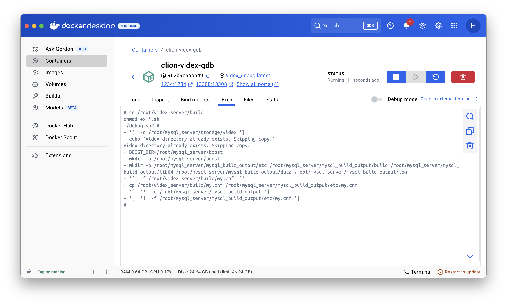
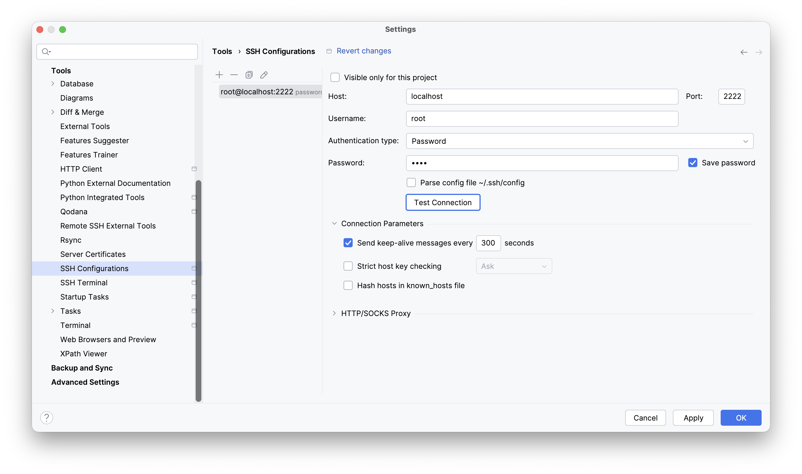
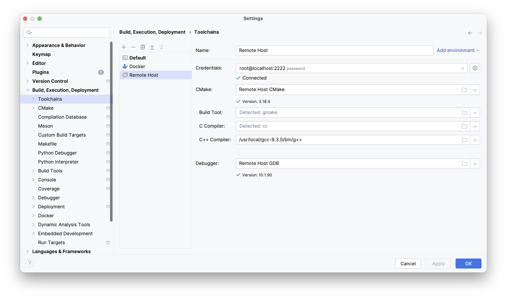
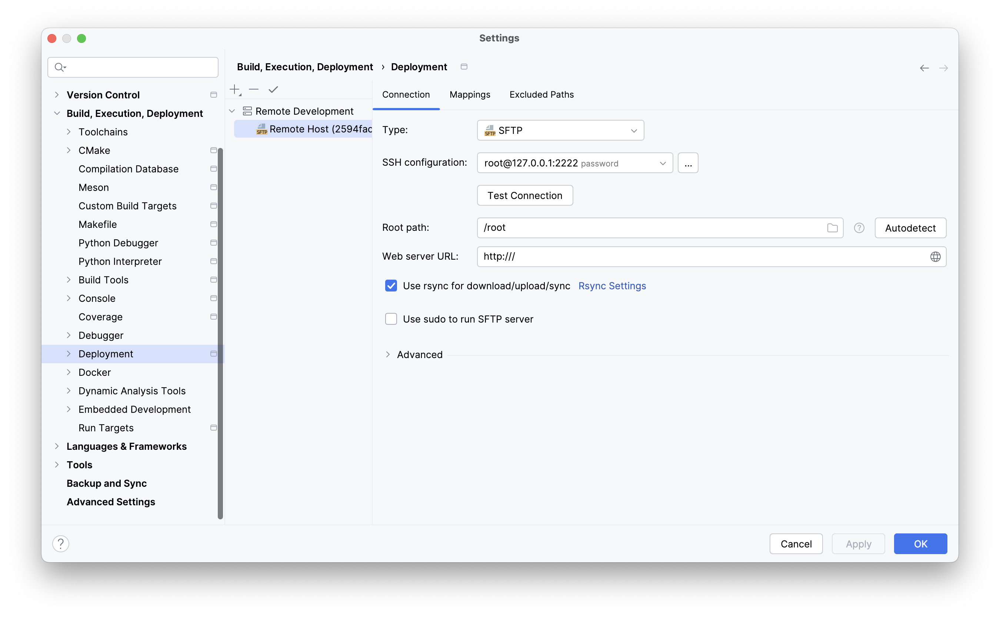
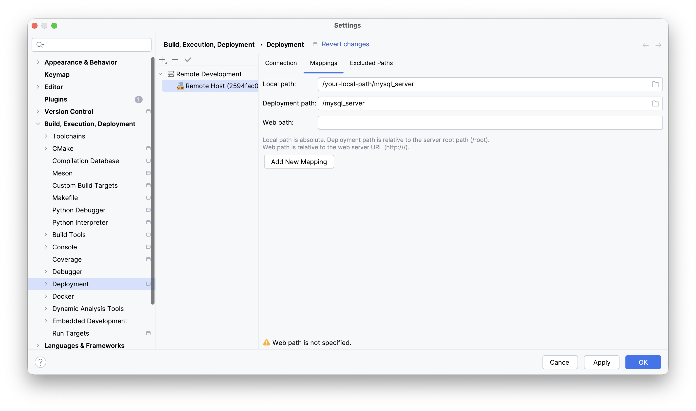
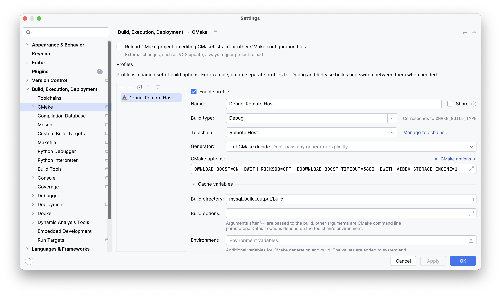
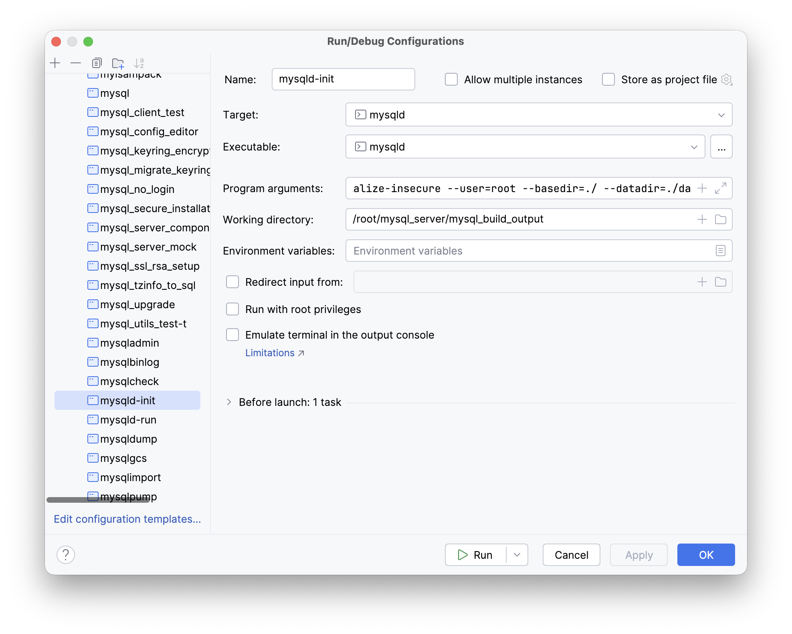
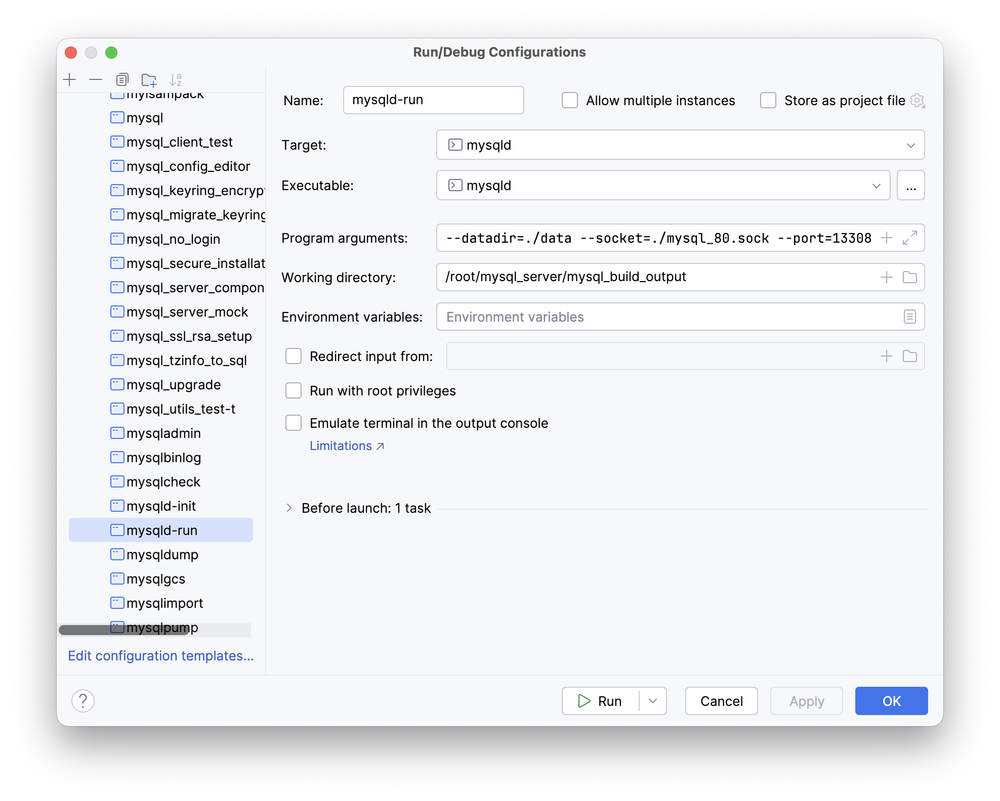
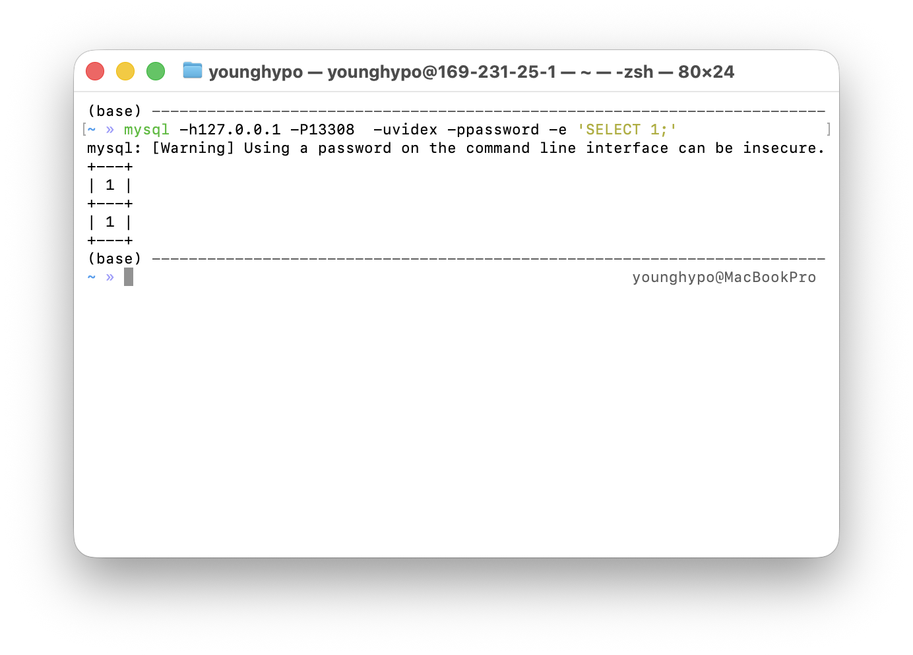
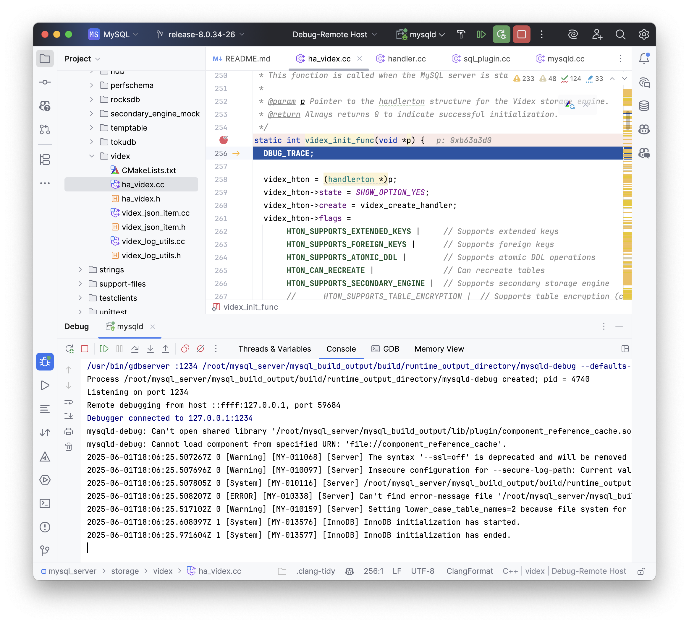

# CLion GDB Remote Debugging VIDEX Guide

This guide shows how to mount the `mysql8` and `videx` projects into a container using Docker, creating a debugging environment isolated from the host environment. The code in the container can be affected by local modifications in real-time, facilitating development and debugging.

## 1. Preparation

Please following the instructions in **Section1 Preparation** in the [installation guide](https://github.com/bytedance/videx/blob/main/doc/installation.md).

## 2. Build and Start the Debug Container

### 2.1 Build Docker Image

```bash
cd $VIDEX_HOME
docker build -t videx_debug:latest -f build/Dockerfile.debug_env .
```

### 2.2 Start the Container and Mount the Project

```bash
docker run -dit \
  --name clion-videx-gdb \
  -p 2222:22 -p 13308:13308 -p 5001:5001 -p 1234:1234 \
  -v $MySQL8_HOME:/root/mysql_server \
  -v $VIDEX_HOME:/root/videx_server \
  videx_debug:latest \
  sleep infinity
```

### 2.3 Run the Debug Script in the Container

**Required for the First Time.** 
Enter the container and execute the compile command:

```bash
cd /root/videx_server/build
chmod +x *.sh
./debug.sh
```



## 3. Open Project in CLion

Open the local `mysql_server` project.

### 4. Configure Remote Development Environment

### 4.1 Configure SSH Connection
1. Go to `Settings` → `Tools` → `SSH Configurations`
2. Add a new configuration:
    - Host: localhost
    - Port: 2222
    - User name: root
    - Password: root
3. Click `Test Connection` to verify the connection



### 4.2 Configure Remote Toolchain
1. Go to `Settings` → `Build, Execution, Deployment` → `Toolchains`
2. Add a new Remote Host toolchain:
    - Name: Remote Host
    - C++ Compiler: /usr/local/gcc-9.3.0/bin/g++



## 5. Configure Remote Path Mapping

1. Go to `Settings` → `Build, Execution, Deployment` → `Deployment`
2. Add a new deployment configuration:
    - Type: SFTP
    - SSH Configuration: Use the SSH configured in the previous step
    - Root path: /root
    - Select `Use rsync for download/...`
3. In the Mappings tab:
    - Local path: Set to the mysql_server path on **your local host**
    - Deployment path: /mysql_server





## 6. Configure CMake Profile
1. Go to `Settings` → `Build, Execution, Deployment` → `CMake`
2. Add a new CMake Profile:
    - Build type: Debug
    - Toolchain: Remote Host
3. CMake options:

```bash
-DWITH_DEBUG=ON -DCMAKE_BUILD_TYPE=Debug -DBUILD_CONFIG=mysql_release -DFEATURE_SET=community -DCMAKE_INSTALL_PREFIX=. -DMYSQL_DATADIR=./data -DSYSCONFDIR=./etc -DWITH_BOOST=/root/mysql_server/boost -DDOWNLOAD_BOOST=ON -DWITH_ROCKSDB=OFF -DDOWNLOAD_BOOST_TIMEOUT=3600 -DWITH_VIDEX_STORAGE_ENGINE=1
```

4. Build directory: mysql_build_output/build



## 7. Configure and Start MySQL Service

### 7.1 Initialize mysqld

1. Go to `Run/Debug Configurations`
2. Search mysqld and add a new instance
    - Name: mysqld-init
    - Target: mysqld
3. Set the program arguments and working directory
4. Click ▶️ to run the mysqld-init

```bash
--defaults-file=./etc/my.cnf --initialize-insecure --user=root --basedir=./ --datadir=./data
```



### 7.2 Start mysqld

1. Go to `Run/Debug Configurations`
2. Search mysqld and add a new instance
    - Name: mysqld-run
    - Target: mysqld
3. Set the program arguments and working directory
4. Click ▶️ to run the mysqld-run

```bash
--defaults-file=./etc/my.cnf --user=root --basedir=./ --datadir=./data --socket=./mysql_80.sock --port=13308
```



## 8. Create Debug User

Execute in the container terminal:

```bash
/root/mysql_server/mysql_build_output/build/runtime_output_directory/mysql \
  -h127.0.0.1 -uroot -P13308 \
  -e "CREATE USER 'videx'@'%' IDENTIFIED WITH mysql_native_password BY 'password'; \
      GRANT ALL ON *.* TO 'videx'@'%'; FLUSH PRIVILEGES;"
```

Test in your local terminal:

```bash
mysql -h127.0.0.1 -P13308 -uvidex -ppassword -e 'SELECT 1;'
```

You will get the following result if all goes well



## 9. Start Videx Server
```bash
cd /root/videx_server
python3.9 -m pip install -e . --use-pep517

cd src/sub_platforms/sql_opt/videx/scripts
python3.9 start_videx_server.py --port 5001
```

## 10. Start GDB Debugging

Switch to mysqld-run, and click debug


